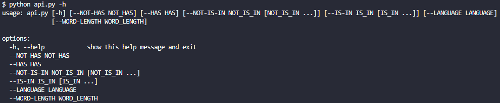

# term.ooo

FindWord: Script that helps to think in words with five letters under certain conditions.

WriteWord: Script that opens your browser and tries to hit the correct day's word.

```python
from write.english import English, Phrase
from write.portuguese import Portuguese
```

```python
how_many = 2 # 1, 2, 4
browser = Portuguese(how_many)
browser.run(how_many)
```

```python
browser = English()
browser.run()
```

